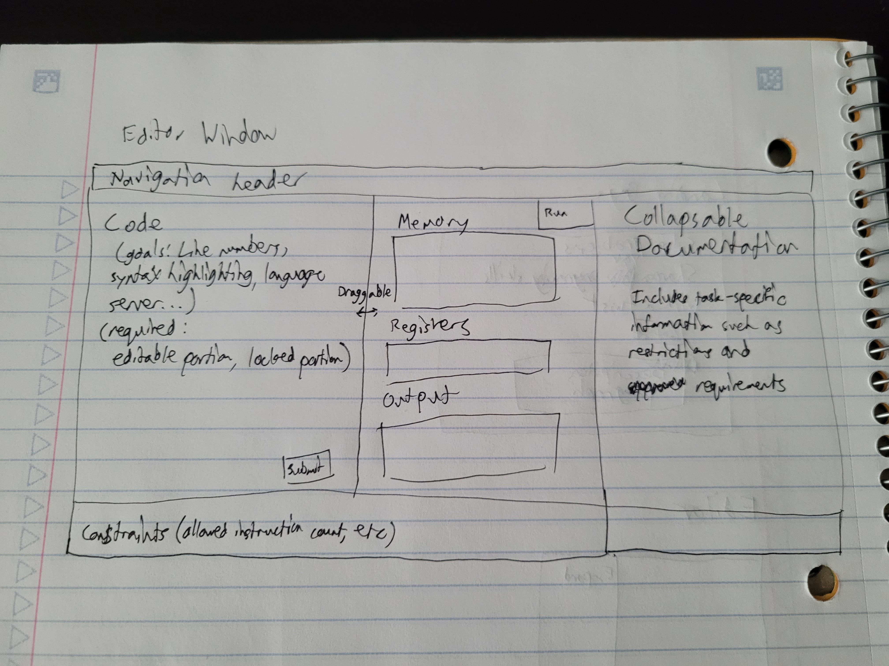

Startup application for BYU CS 260.

## Quick Links

[Notes](notes.md)

## Overview

### Elevator pitch

LineBreak is a competitive programming website where two programmers concurrently modify the same code in a race to outmaneuver each other and achieve their seperate objectives.

### More details

Every challenge starts with some initial readonly code and a (mutually exclusive) objective for each programmer. Every turn, both programmers insert exactly one instruction into the program. If the final code - with both new instructions - meets one programmer's objectives, that programmer wins! If not, both programmers go again.

Programming is done in a simple 8-bit assembly environment, ChASM, that can be interpreted by both the server and the browser. Read-only portions of the code prevent freely modifying the "winning" code for an easy win.

## Mockup

This mockup shows the main code editor screen, the meat of the application. It's a rough sketch, but it communicates the ideas.

## Technologies

-   HTML - Pages for signup, playing, and viewing challenge history.
-   CSS - Styling with good whitespace, color, etc (dark mode by default, obviously)
-   JavaScript - Interpreting/checking ChASM, handling syntax highlighting/etc (if I get to it), sending each player's updates back and forth.
-   React - SPA; reactively update views to match processor state and programmer input
-   Service - backend service with endpoints for:
    -   Beginning a new game
    -   Loading previous games
    -   Saving custom challenges
-   External service - QR code generator for sharing replays!
-   DB/Login - store users, custom challenges, games, and challenge history. To play a game against someone else (other than just practice) or create a custom challenge, users must authenticate (credentials stored securely)
-   WebSocket - as each user plays, their moves are sent to each other

## Startup HTML

For this deliverable I built out the structure of my application using HTML.

-   [x] **HTML pages** - three HTML pages that represent a landing page, a profile page, and a play page
-   [x] **Links** - the landing page has links to the profile page. The profile page and the play page link to each other and to the landing page
-   [x] **Text** - Promotional text and documentation is interspersed throughout
-   [x] **Images** - The LineBreak logo is displayed prominently on each page
-   [x] **DB/Login** - Input box and submit button for login. The statistics represent data pulled from the database
-   [x] **Third Party Service Calls** - A QR code is generated and displayed on the site. It's currently static, but it will be dynamic eventually.
-   [x] **WebSockets** - Communication between the two opponents requires websockets
